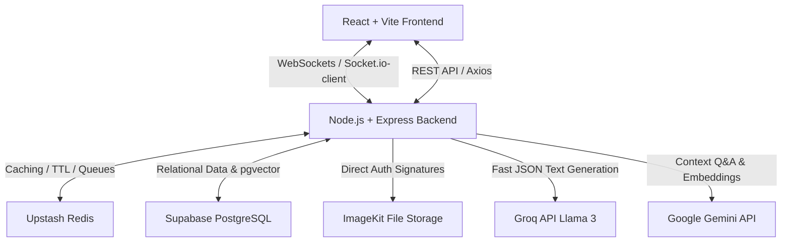

# OmniChat (CognitiveChat) — Project Specification & Architecture Blueprint

OmniChat is a state-of-the-art, AI-augmented real-time messaging workspace designed to solve collaboration drag and information overload. It bridges the gap between traditional chat systems (like WhatsApp/Slack) and modern AI agents, offering intelligent workflows that enhance productivity.

---

## 1. System Architecture

### The Stack:
*   **Frontend**: React, Vite, TypeScript, TailwindCSS, Zustand (State Management), TanStack Query (Server Caching), Socket.io-client.
*   **Backend**: Node.js, Express, TypeScript, Socket.io, BullMQ (Async Background Queue).
*   **Databases**: PostgreSQL (Supabase) + `pgvector` extension, Redis (Upstash) for presence, rate limits, and short-term caches.
*   **Third-Party APIs**: Groq (for fast chat generation), Gemini API (for embeddings and chat history context Q&A), ImageKit (for image/document hosting).

---

## 2. Core Messaging Engine (The Foundation)

OmniChat supports typical messaging features built with high-performance and strict security rules:

### A. Real-Time Socket.io Engine
*   **Presence (Online/Offline Status)**: Tracked via periodic heartbeats stored in Redis with a 30-second TTL. User transitions emit events to rooms.
*   **Typing Indicators**: Controlled using ephemeral Redis keys (`typing:{roomId}:{userId}`) with a 3s TTL. Avoids database writes for high-frequency events.
*   **Offline Message Replay**: When a client reconnects, the socket handshake queries PostgreSQL for messages sent after the client's `last_read_at` timestamp.
*   **Unread Count Badges**: Incremented in Redis upon new messages and cleared (`DEL`) when a user joins the room.

### B. User Authentication & Security
*   **JWT Handshake**: WebSockets and REST routes are gated behind secure JWT validation.
*   **Refresh Token Rotation**: Refresh tokens are stored securely in `HttpOnly` cookies and hashed with SHA-256 in the database. On renewal, the token is rotated. If an old token is reused, a "breach detection" trigger revokes all active sessions for the user.
*   **IDOR Protection**: The `assertOwnership(table, id, userId)` checks ownership on all records. If a user queries a room they don't belong to, the API returns a `404 Not Found` (instead of `403 Forbidden`) to prevent resource scanning.

---

## 3. Integrated AI Features (The Superpowers)

### Feature 1: Semantic Chat Search
*   **How it works**: Traditional keyword searches fail if you search for concepts (e.g. searching "deadline" misses a message saying "needs to be submitted by Tuesday").
*   **The AI Solution**: 
    1. When a message is sent, a background BullMQ worker extracts its text, calls Gemini's `text-embedding-004` (768-dimension), and stores the vector in PostgreSQL.
    2. When searching, the query is embedded, and the database computes the **Cosine Similarity** (`<=>` operator) to return the most contextually relevant messages.

### Feature 2: Room Q&A ("Ask Chat Memory")
*   **How it works**: The user can open the AI Assistant panel and check a box saying *"Search current room context"* or ask: *"what did he tell in the last 5 days about the project?"*
*   **The AI Solution**:
    1. The system converts the query into a database search.
    2. It queries messages from the room within the specific date range (`created_at >= NOW() - INTERVAL '5 days'`).
    3. It aggregates the chat log (e.g., `Sender: message`) and inputs it into Gemini as context.
    4. Gemini answers based *only* on the actual conversation history, citing who said what and when.

### Feature 3: "Catch Me Up" (Thread Summarizer)
*   **How it works**: Joining a busy chat after hours forces you to read through dozens of messages.
*   **The AI Solution**: A "Catch Me Up" button fetches the last 50-100 unread messages, formats them as a clean text transcript, and streams a structured summary back via Server-Sent Events (SSE). It outlines:
    *   *Executive Summary*: What happened.
    *   *Key Decisions*: What was resolved.
    *   *Action Items*: What tasks are assigned to the user.

### Feature 4: Contextual Smart Replies
*   **How it works**: Replying to simple messages takes time.
*   **The AI Solution**: The chat bar continuously generates 3 quick suggestion chips based on the last 10 messages. Tapping a chip sends the response instantly. Responses are cached in Redis to keep layout changes fast.

### Feature 5: Tone Shifter & Inline Editor
*   **How it works**: Drafts can sometimes sound too blunt, casual, or wordy.
*   **The AI Solution**: The user types a rough message and hits the sparkle button to shift it into one of 6 tones (Professional, Casual, Friendly, Direct, Formal, Funny) or click "Improve" to format the grammar inline.

### Feature 6: Chat-to-Calendar Auto-Scheduler
*   **How it works**: Planning meetings in chat requires manually opening a calendar, copying dates, and sending invitations.
*   **The AI Solution**:
    *   **Background Parser**: As messages flow, a fast parser checks for date/time expressions (e.g. *"let's sync tomorrow at 3pm"*).
    *   **Intent Verification**: If matched, a background prompt extracts event details relative to the current message timestamp.
    *   **Actionable UI**: A calendar badge appears on the message: **"📅 Add to Calendar"**.
    *   **Event Generation**: Clicking it opens a form prefilled with the event title, start/end dates, and participant list, with a one-click link to sync with Google Calendar or export an `.ics` file.

---

## 4. Visual Identity & Interface Design

OmniChat is built on a dark-mode glassmorphic theme designed to feel responsive, premium, and alive:

*   **Layout**: A 280px left sidebar (rooms list, user profile, and "AI Assistant" shortcut) and a flexible right-hand chat window.
*   **Glassmorphic Accents**: Translucent blur panels (`backdrop-blur-md`), dark border lines (`border-white/5`), and subtle radial gradient lights glowing in the background corners.
*   **Color Palette**:
    *   *Primary background*: `#09090b` (Deep Zinc Black)
    *   *Primary UI accents*: `#6366f1` (Indigo 500)
    *   *AI features branding*: `#8b5cf6` (Violet 500)
    *   *Chat Bubble colors*: Indigo (Sent) vs. Light Zinc (Received)
    *   *Offline state*: `#94a3b8`
    *   *Online state*: `#22c55e`
*   **Micro-Animations**:
    *   *Message delivery*: Bubbles slide up with `animate-in slide-in-from-bottom-2 duration-150`.
    *   *AI chips & alerts*: Fade in smoothly with hover scales.
    *   *Typing state*: 3 bouncing dots CSS animation.
