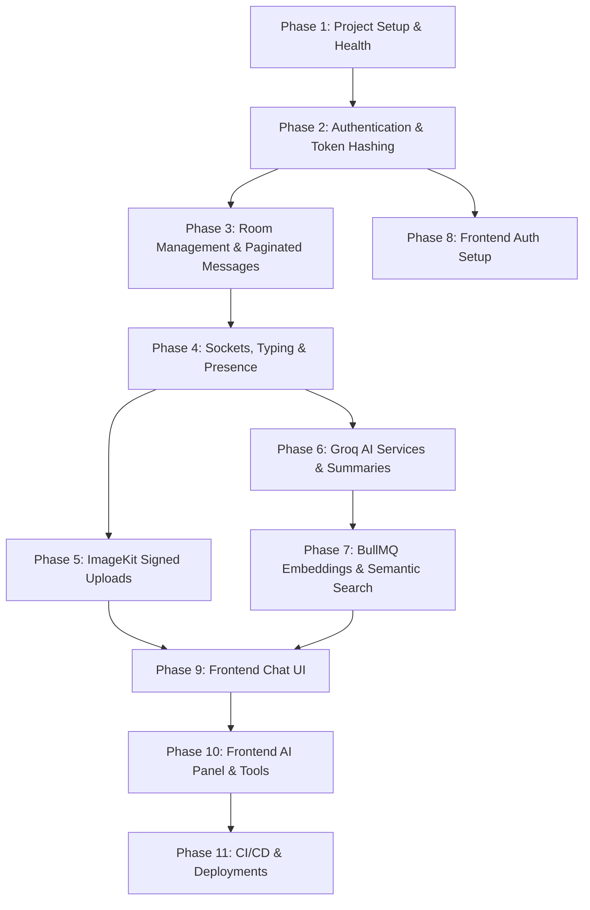

# Detailed Step-by-Step Implementation Plan

This document outlines the granular, step-by-step implementation details for each phase of the project. It integrates the architectural fixes from the review and specifies exactly how each component will be built.

---

## Tool API Keys Needed

To build and run this application, you will need to provision the following third-party credentials:

1. **Supabase (Postgres):**
   - `SUPABASE_URL` (API URL)
   - `SUPABASE_SERVICE_KEY` (Service role key for administrative/background queries)
   - *Database Connection String* (for direct connection via pg/Pool)
2. **Upstash (Redis):**
   - `UPSTASH_REDIS_URL` (Redis connection URL)
   - `UPSTASH_REDIS_TOKEN` (Password/Token)
3. **ImageKit (File Hosting):**
   - `IMAGEKIT_PUBLIC_KEY`
   - `IMAGEKIT_PRIVATE_KEY`
   - `IMAGEKIT_URL_ENDPOINT`
4. **Groq (Text LLM):**
   - `GROQ_API_KEY`
5. **Google Gemini (Embeddings):**
   - `GEMINI_API_KEY`
6. **JWT Secrets (Ephemeral):**
   - `JWT_ACCESS_SECRET` (Generate using any random cryptographically secure string)
   - `JWT_REFRESH_SECRET` (Generate using any random cryptographically secure string)

---

## MCP Usage Guidelines

> [!NOTE]
> To optimize context tokens, we will minimize direct MCP tool usage (like Supabase schema explorers). 
> Instead of querying Supabase via MCP, I will provide SQL scripts for you to run in the Supabase SQL Editor.

---

## Phase-by-Phase Plan



### Phase 1: Project Setup & Server Foundation
* **Step 1.1:** Initialize the workspace directory structure. Set up `/server` and `/client` directories with standard node projects. Configure `/server/.gitignore` and `/client/.gitignore`.
* **Step 1.2:** Install basic backend dependencies: `express`, `cors`, `helmet`, `zod`, `winston`, `pg`, `dotenv`, and developer tools (`typescript`, `ts-node-dev`, `@types/node`, `@types/express`, `@types/cors`, `@types/pg`).
* **Step 1.3:** Create `server/src/config/env.ts` using `zod` to validate all environment variables. The server must crash immediately on startup if any key is missing or invalid.
* **Step 1.4:** Create `server/src/config/db.ts` to initialize a pool connection to Supabase PostgreSQL using `pg`.
* **Step 1.5:** Create `server/src/config/redis.ts` to initialize an `ioredis` client connecting to Upstash Redis.
* **Step 1.6:** Implement Winston logging in `server/src/utils/logger.ts` with output formatting that prevents logging sensitive headers, tokens, or passwords.
* **Step 1.7:** Write database schema creation script (`schema.sql`) and run it in the Supabase SQL Editor to enable `uuid-ossp`, `vector`, and `pg_trgm`, and initialize tables.
* **Step 1.8:** Create `server/src/app.ts` and set up standard health endpoints:
  - `GET /health` (responds with `{ status: "ok" }`)
  - `GET /ready` (verifies connection to Postgres and Redis, responds with `{ status: "ok", db: "connected", redis: "connected" }`)

---

### Phase 2: Custom Authentication & Session Limits
* **Step 2.1:** Create `users` and `refresh_tokens` database tables.
* **Step 2.2:** Write Zod schemas for user registration (`username`, `email`, `password`) and login validation.
* **Step 2.3:** Implement `POST /api/v1/auth/register`:
  - Verify email/username uniqueness.
  - Hash passwords using `bcrypt` (12 salt rounds).
  - Insert user, issue access token, and return.
* **Step 2.4:** Implement `POST /api/v1/auth/login`:
  - Validate email and password.
  - Generate an access token (short lived: 15 min).
  - Generate a random UUID refresh token. Hash it with SHA-256 using Node's `crypto` module, save the hash in the DB, and set the raw token in an `HttpOnly; Secure; SameSite=Strict` cookie.
* **Step 2.5:** Implement token refresh rotation (`POST /api/v1/auth/refresh`):
  - Read cookie, SHA-256 hash it, look up in database.
  - If valid and unexpired: invalidate/revoke the old token, issue a new access token, and rotate the cookie with a brand new refresh token.
  - **Rotation Breach detection:** If a revoked refresh token is reused, immediately delete ALL active refresh tokens for that user ID to force re-authentication.
* **Step 2.6:** Implement `POST /api/v1/auth/logout`:
  - Extract active JTI (from Access Token) and blacklist it in Redis for the remainder of its TTL.
  - Revoke the active refresh token in Postgres and clear the client cookie.
* **Step 2.7:** Implement JWT validation middleware (`auth.middleware.ts`) checking access token validity and Redis blacklist.

---

### Phase 3: Room Management & Paginated Messages
* **Step 3.1:** Create `rooms` and `room_members` tables.
* **Step 3.2:** Implement `POST /api/v1/rooms`:
  - Validate parameters (room `type` either 'direct' or 'group').
  - Use a database transaction to insert the room and add initial members.
* **Step 3.3:** Implement membership lookup endpoints:
  - `GET /api/v1/rooms` (list rooms for current user).
  - `GET /api/v1/rooms/:roomId` (retrieve detailed metadata).
  - `GET /api/v1/rooms/:roomId/members` (paginated list of users in the room).
* **Step 3.4:** Add validation checks:
  - Restrict membership mutation (`POST` / `DELETE` on members) to room owners or admins.
  - Ensure users cannot fetch details of rooms they are not members of (IDOR protection via `assertOwnership` helper returning 404).
* **Step 3.5:** Implement `GET /api/v1/messages/:roomId`:
  - Apply cursor-based pagination using the composite cursor: `ORDER BY created_at DESC, id DESC`.
  - Validate `limit` parameter using Zod (max 100).
* **Step 3.6:** Implement message mutations (`PATCH` for edits, `DELETE` for soft-deletes):
  - `PATCH /api/v1/messages/:messageId`: Allow only the sender to edit. Verify and store edit timestamp (`edited_at`).
  - `DELETE /api/v1/messages/:messageId`: Allow sender to soft-delete. Set `deleted_at = now()` and clear content fields.

---

### Phase 4: WebSocket Integration & Presence Server
* **Step 4.1:** Install `socket.io` and configure a real-time server instance attached to the Express HTTP listener.
* **Step 4.2:** Build JWT authentication middleware for the socket handshake to reject unauthenticated clients.
* **Step 4.3:** Implement the `room:join` event:
  - Verify client membership in the target room.
  - Query DB for missed messages since `room_members.last_read_at`.
  - **Replay Safety Cap:** Return a maximum of 50 messages. If the count exceeds 50, send a flag `has_gap: true` informing the client to fetch history via REST.
* **Step 4.4:** Implement `message:send` handler:
  - Store message to PostgreSQL.
  - Broadcast `message:new` event to all sockets joined to the room.
  - Dispatch embedding generation task to BullMQ.
* **Step 4.5:** Implement read receipt synchronization:
  - `message:read` event inserts/updates a row in the `message_reads` table (atomic upsert) and updates `room_members.last_read_at`.
  - Broadcast update to the room.
* **Step 4.6:** Implement typing indicators:
  - On `typing:start`, save `typing:{roomId}:{userId} = 1` in Redis with `EX 3`.
  - Broadcast indicator status to room members.
* **Step 4.7:** Implement presence heartbeats:
  - Every 15 seconds, client sends a heartbeat.
  - Save `presence:{userId} = "online"` in Redis with `EX 30`.
  - Broadcast presence status changes to online contacts.

---

### Phase 5: ImageKit Signed Uploads
* **Step 5.1:** Set up ImageKit account and configure environment keys.
* **Step 5.2:** Implement `/api/v1/files/sign` endpoint:
  - Verifies user authorization and returns signed authentication parameters `{ token, expire, signature, publicKey, urlEndpoint }` using the ImageKit SDK.
* **Step 5.3:** Client-side file type and Magic Bytes validation (implemented later in client phases) to verify file headers before uploading directly to ImageKit.
* **Step 5.4:** Implement upload completion handler:
  - Once ImageKit returns success to the client, the client posts file metadata (URL, public ID, name, size) to `POST /api/v1/messages/:roomId/file`.
  - Server verifies parameters and inserts message with type `'file'` or `'image'`.

---

### Phase 6: Core AI Services (Groq API & Summarization)
* **Step 6.1:** Install the official `groq-sdk` npm package.
* **Step 6.2:** Create `server/src/modules/ai/prompts.ts` defining strict system prompts:
  - Enforce output constraints (e.g., JSON array for replies, clean styling for editor).
  - Include guardrails preventing prompt injection.
* **Step 6.3:** Implement `/api/v1/ai/smart-reply`:
  - Fetch last 10 messages from PostgreSQL.
  - Structure prompt, call Groq API (e.g., using `llama-3.3-70b-versatile` or similar model), parse response into 3 suggested reply strings.
  - Cache results in Redis using a key hashed from the messages with a 5-minute TTL.
* **Step 6.4:** Implement `/api/v1/ai/editor` and `/api/v1/ai/tone` POST routes:
  - Capture user input string and target instructions (or selected tone pill).
  - Execute Groq prompt, return revised text string.
* **Step 6.5:** Implement `/api/v1/ai/summarize`:
  - Fetch last 50-100 messages chronologically.
  - Format list as: `[Sender Display Name]: [Message Text]` string transcript.
  - Send directly to Groq. Stream summary using Server-Sent Events (SSE).
* **Step 6.6:** Setup AI-specific rate limiting in Redis: limit user to 10 AI operations per minute. Return standard 429 errors with clean fallback UI notifications.

---

### Phase 7: BullMQ Embeddings & Semantic Search
* **Step 7.1:** Install `bullmq` and configure it to use the Upstash Redis instance.
* **Step 7.2:** Setup `embedding.queue.ts` worker:
  - Setup a background worker listening for message indexing tasks.
  - On new task, extract message text, call Gemini API (`text-embedding-004`) to generate a 768-dimensional vector array.
  - Update PostgreSQL message record: `UPDATE messages SET embedding = $1 WHERE id = $2`.
  - Configure worker with exponential backoff configuration (3 retries, starting at 2s delay) to handle Gemini API rate limiting.
* **Step 7.3:** Implement `/api/v1/messages/:roomId/semantic-search`:
  - Accept query parameter `q`.
  - Generate query embedding using Gemini.
  - Query PostgreSQL using cosine similarity (`<=>` operator):
    ```sql
    SELECT id, room_id, sender_id, type, content, created_at 
    FROM messages 
    WHERE room_id = $1 AND embedding IS NOT NULL
    ORDER BY embedding <=> $2
    LIMIT 20;
    ```
  - Discard matches where cosine distance is > 0.35 (similarity < 0.65).

---

### Phase 8: React Frontend - Base, State & Auth
* **Step 8.1:** Bootstrap a React project using Vite (`npx create-vite ./ --template react-ts`) in `/client`.
* **Step 8.2:** Setup Tailwind CSS and install shadcn/ui.
* **Step 8.3:** Create `tokenStore.ts` storing the JWT access token in memory.
* **Step 8.4:** Build two Axios instances:
  - `refreshClient` (for raw refreshing without interceptors).
  - `client` (primary API client with JWT attachment and 401 error handler queue). If a 401 occurs, queue requests, perform single-flight refresh, and replay.
* **Step 8.5:** Implement Login, Registration, and protected route router components using React Hook Form + Zod.

---

### Phase 9: React Chat UI & Real-Time Sync
* **Step 9.1:** Build main application layout with Sidebar (rooms list, active states, search bar) and Chat Feed.
* **Step 9.2:** Create message bubbles supporting rich formats: texts, images, attachments, reply indicators, and reactions.
* **Step 9.3:** Integrate TanStack Query for room lists and infinite-scrolling message feeds (relying on composite cursors).
* **Step 9.4:** Implement Socket hook `useSocket.ts`:
  - Re-connect on user login.
  - Handle real-time messages, typing indicators, read receipts, and online status updates.
* **Step 9.5:** Apply browser-based magic-bytes validation before uploading attachments directly to ImageKit.

---

### Phase 10: React AI Panel & Tools
* **Step 10.1:** Add AI Suggestion Chips directly above the chat message input field.
* **Step 10.2:** Build a formatting menu inside the text input for "AI Refine" (Tone choices and clean editing).
* **Step 10.3:** Create a sliding sidebar sheet for the "AI Assistant" supporting streaming Markdown chat.
* **Step 10.4:** Implement the "Summarize Thread" modal, reading and parsing the server SSE stream.

---

### Phase 11: CI/CD & Deployments
* **Step 11.1:** Setup GitHub Actions CI check: run `npm ci`, `npx tsc --noEmit`, and `npm audit` on every PR.
* **Step 11.2:** Deploy React application to Vercel. Configure base API endpoints.
* **Step 11.3:** Deploy Node.js server container to Railway. Inject validated environment variables.

---

## Verification Plan

### Phase 1 & 2 Verification
- Execute `npm run dev` with missing env values, verify server crashes with explicit Zod feedback.
- Invoke `GET /ready` and ensure both Postgres and Redis show connected.
- Execute concurrent logins on the same account to test rotation breach cleanup.

### Phase 4 & 5 Verification
- Send 60 messages while User B is disconnected. Reconnect User B and verify they receive exactly 50 messages, then paginate the remaining 10.
- Attempt upload of a `.exe` file renamed to `.png`, verify signature validation blocks the upload.
- Mock Groq rate limits (force HTTP 429) and verify frontend gracefully displays "AI busy" indicator instead of breaking layout.
